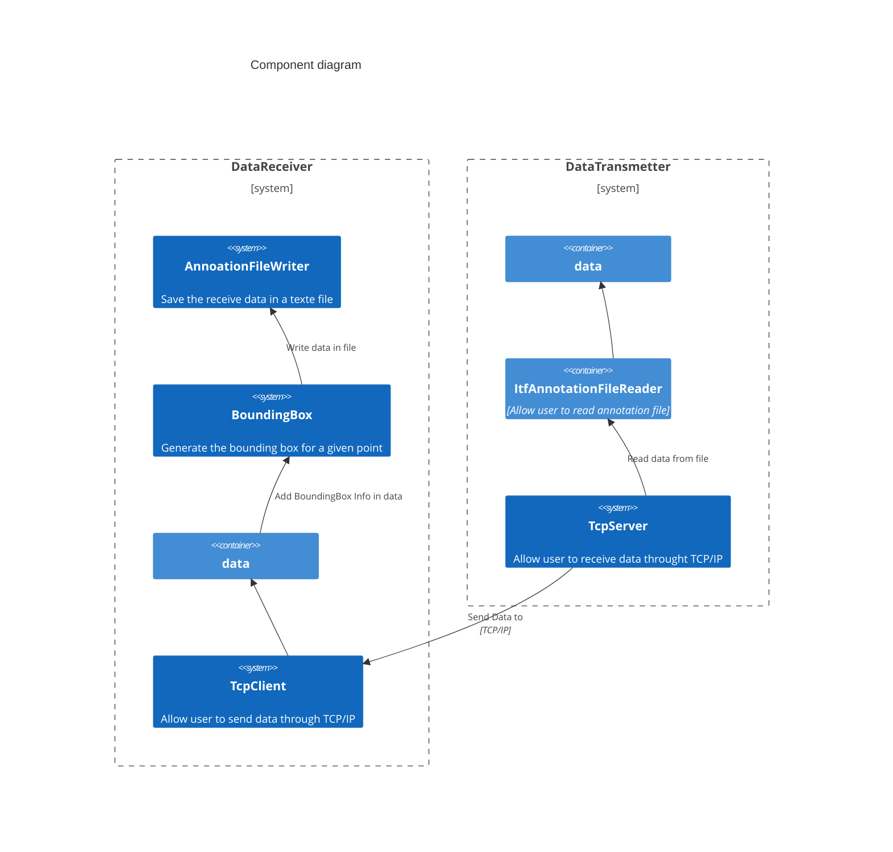

# Definition

## Annotation

## Data Receiver

The receiver is a TCP server.
You should be able to give the IP address and port number trough a config file or by using parameter.
The Data Receiver should be ready to receive data (see DaTypes.hpp -> metadata_t), to insert the BoundingBox and to save it in an output file.

## Data Transmetter

The receiver is a TCP client.
You should be able to give the IP address and port number trough a config file or by using parameter.
The Data Transmetter should be able to transmit Data read from an input file.

## Class diagram

```meramaid
classDiagram
DataReceiver .. TcpServer
DataReceiver : bool isConnected()
DataReceiver : void setOutputFilename()
DataReceiver : string getInputFilename()
DataReceiver : string m_ip
DataReceiver : string m_filename
DataReceiver : int m_port
DataReceiver : bool m_connected
DataTransmetter .. TcpClient
DataTransmetter : void setInputFileName()
DataTransmetter : string getOutputFilename()
DataTransmetter : string m_ip
DataTransmetter : int m_port
DataTransmetter : string m_filename
ItfAnnotationFileReader : virtual bool open()
ItfAnnotationFileReader : virtual bool getNext()
ItfAnnotationFileReader : virtual void close()
ItfAnnotationFileReader : string m_filename
TcpClient : string getIp()
TcpClient : int getPort()
TcpClient : void setIp()
TcpClient : void setPort()
TcpClient : bool start()
TcpClient : void stop()
TcpClient : string m_ip
TcpClient : int m_port
TcpClient : int m_socket
TcpServer : string getIp()
TcpServer : int getPort()
TcpServer : void setIp()
TcpServer : void setPort()
TcpServer : bool start()
TcpServer : void stop()
TcpServer : string m_ip
TcpServer : int m_port
TcpServer : int m_socket
```

## Component diagram



We propose you to implements the following program:

## First option

  Modify the file prog1.cpp (in 4_Sample/Intership/src/) to implemente the following requirements
  Generation of an ouput file containing the bounding box for all the read points from the annotation file
  The bounding box should be a square 20 pix by 20 pix.
  When excuting the program in delivery/bin an output file should be saved in the following folder delivery/data and named bb_annotation.txt
  For the Annotation file reader create a class named AnnotationFileReader heriting from ItfAnnotationFileReader

## Second option

  Modify the file prog1.cpp (in 4_Sample/Intership/src/) to implemente the following requirements
  Same as the previous one but the annotation file is read by DataTransmetter, then send to the DataReiver
  You will have to generate an oupput file wish contain the boudinding box.
  When excuting the program in delivery/bin an output file should be saved in the following folder delivery/data and named bb_annotation.txt

## Third option

  Modify the file prog2.cpp (in 4_Sample/Intership/src/) to implemente the following requirements

  <b>For this part make sure OpenCV is installed on your laptop.</b>

- generation an ouput file containing the bounding box for all the receive points
- you have to print all the received points thanks to OpenCV and to record it in an mp4 file
- if a parameter is given when  launching the program you will have to print the point and the bounding box (the previous draw have to be cleared)

  When excuting the program in delivery/bin an output file should be saved in the following folder delivery/data and named bb_annotation.txt

## Fourth option

  Modify the file prog2.cpp (in 4_Sample/Intership/src/) to implemente the following requirements

  <b>For this part make sure OpenCV is installed on your laptop.</b>

  When excuting the program in delivery/bin an output file should be saved in the following folder delivery/data and named bb_annotation.txt

- Same as the previous one but you have to plot the bounding box
- You will have two print mode (keep or clean)
- keep : mean to let the previous trace, you only have to plot the point
- clean : mean to remove the previous trace, we only have to see one point and the corresponding boundingBox.

If needed you can modify the CMakeLists and all any other file

You have to compile the code in the root folder by using the following command:

```bash
cmake -S . -B build
cmake --build build --target install
```

Then your production will be available in the folder named delivery

To see if your implementation is correct or finish go to the delivery folder and then

```bash
cmake -S . -B build -DCMAKE_BUILD_TYPE=RELEASE
cmake --build build
cd build
ctest
```
